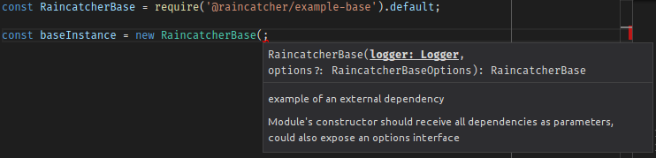

[id='raincatcher-core-getting-started-{chapter}']
= RainCatcher-core Getting Started

Getting started with the Feedhenry RainCatcher Core Repository. The core repository is
a development framework that software developers can use build their
own modules or extend existing modules.

== Developing

RainCatcher supports and is tested on Node.JS 6 and should run on latest LTS.

Check your Node.JS version running `node -v`

=== Setup

[source,bash]
----
    git clone https://github.com/feedhenry-raincatcher/raincatcher-core.git
    cd raincatcher-core
    npm install -g lerna
    npm install
    lerna bootstrap
----

== Repository folder structure

This repository contains many subpackages managed through https://lernajs.io/[Lerna],
and they are contained in the following directories:

|====
|Directory | Description

|*client/* |Front-end packages, from API clients to user interface modules
|*cloud/* |Cloud app packages, intended to be run on an Node.JS environment
|*demo/*  |Full-fledged Demo applications, showcasing the usage of multiple modules
|*templates/*| Templates and examples for other packages in the repository
|====

== Creating a new package

In order to create a new package, we recommend duplicating
`templates/base`, which is a sample base that contains the skeleton expected of a new package.
Review the `/templates/base/README.md` for further information.

=== Package structure

|====
|Directories|Description

|*src/*| Contains the TypeScript sources.
|*test/*| The unit tests for the module. Should contain a `mocha.opts` file for configuring
Mocha.
|*coverage/ and .nyc_output*|Istanbul output, should be .gitignored.
|*example/*|Example usage for module.
|====

=== Module structure

RainCatcher modules are written in [TypeScript](http://typescriptlang.org).

The main files are modules that by default export a class containing the main
implementation for the module's intent, with a named export containing a public
interface that should be depended upon, and reimplemented.

[source,javascript]
    import Implementation, { PublicInterface } from '@raincatcher/module';

==== Default exports

For each module, the default export is the main implementation itself, as the most
common scenario is it being used by the requiring code.

Other RainCatcher modules depend only on the interfaces explained in the next section Public
Interface

[#public-interface]
==== Public interface

Along with the default export, all modules include a public interface definition that are
depended upon by other RainCatcher modules instead of depending on the implementation itself.
See the [BaseModule](templates/base/src/index.ts) for an example.

This is done so they can be more easily replaced or extended by custom implementations.
Custom modules can skip this concern.

==== Unit test structure

For each module unit tests are present on the `test/` folder, the Mocha default for storing the
`mocha.opts` file as well.

Since code that requires a module's tests are most likely interested in a reusable test suite,
the `test/index.ts` file's default export should be a function that receives all the required
parameters for running the test suite on a given implementation of the interface.

[source,javascript]
----
import publicInterfaceTestSuite from '@raincatcher/module/test';
import { PublicInterface } from '@raincatcher/module';

class MyClass implements PublicInterface {
  // ...
}

// test/MyClass.ts
describe('MyClass', function() {
  publicInterfaceTestSuite(MyClass);
});
----

Tests for the module's specific implementation can be included as other files inside the same
folder.

=== Using modules from JavaScript

We recommend users to write their code in TypeScript, however JavaScript usage is partially
supported by editor plugins that will still offer suggestions based on the TypeScript interfaces
and access to jsdoc annotations:

See the example on [templates/js] for more information also for reusing the unit test suites
from JavaScript code.

=== Publishing modules

Before publishing the typescript modules, do a manual compilation step via `npm run build` on
the root of the repository.

=== Repository commands

 `npm run test` - run unit tests

 `npm run bootstrap` - perform boostrap for all modules

 `npm run start` - run top level applications

 `npm run lint` - execute tslint for all modules

 `npm run build` - execute the build command for all modules, compiling TypeScript sources to JavaScript

 `npm run cleanInstall` - perform install without executing additional scripts
